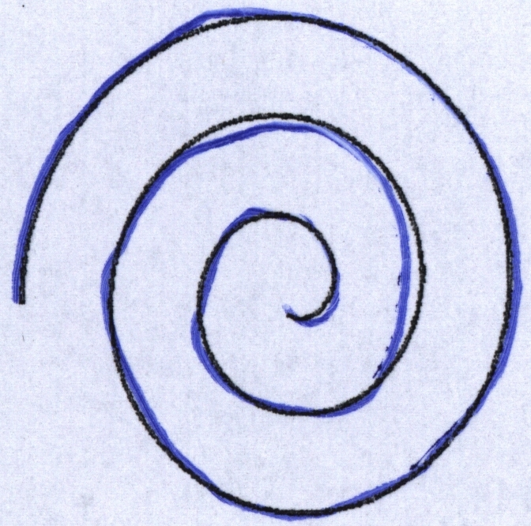
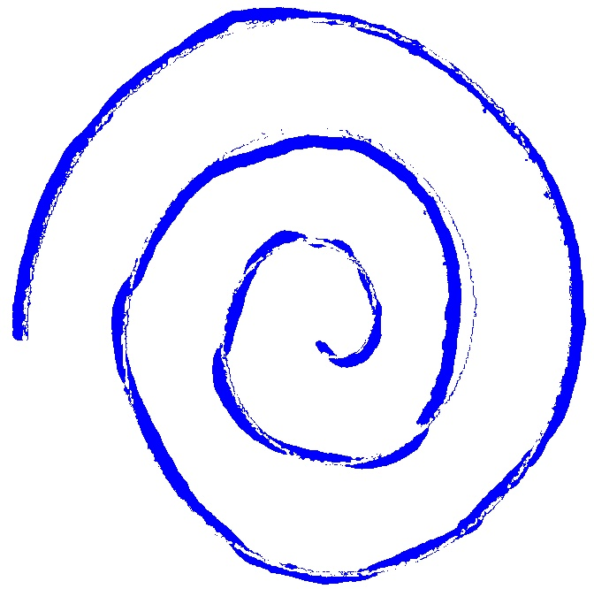

# ⚙️ Processamento de imagens

[Processamento](src/image-processing.py)

Foram consideradas apenas imagens das espirais, ao total foram utilizadas 683 imagens. Inicialmente foram extraídos apenas os traços das espirais.
Extraindo traço realizado com caneta azul, ou realizados com lápis. 

Ex.:

| Imagem original | Resultado obtido |
| :---: | :---: |
|  |  |

Após isso as imagens foram usadas para o treinamento da rede.

