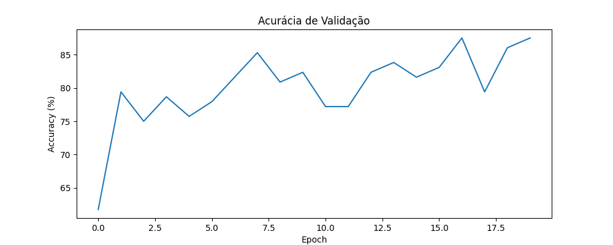
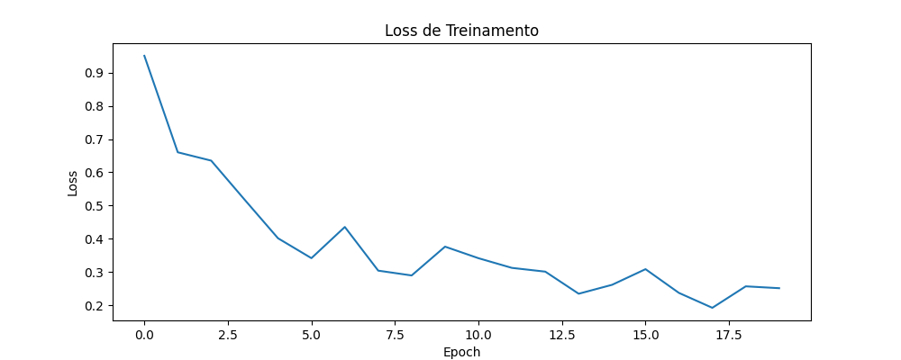

# 🧠️ Treinamento

As imagens foram organizadas em duas classes: controle e pacientes com Doença de Parkinson.
A divisão do conjunto de dados foi realizada utilizando a biblioteca splitfolders do python ([Divisão](src/split-data.py)). 

O dataset foi separado da seguinte forma:

* 70% para treinamento
* 20% para teste
* 10% para validação

---
### 🔄 Transformações:

Para aumentar a variedade do conjunto de dados e melhorar a capacidade de generalização da rede neural, foram aplicadas técnicas de data augmentation, gerando imagens sintéticas a partir das imagens originais.

As transformações utilizadas foram:

1. Redimensionamento das imagens para 224x224 pixels
2. Rotação aleatória entre -15° e +15°
3. Espelhamento horizontal aleatório
4. Conversão das imagens para tensor
5. Normalização

---

### 🧠️ Rede
Foi realizado um teste utilizando uma rede neural do tipo **Vision Transformer (ViT)**, para isso foi utilizado a
biblioteca _timm_.
O modelo foi configurado com:

* 2 neurônios de saída, correspondentes às classes do problema
* 20 épocas de treinamento

A atualização dos pesos da rede foi realizada utilizando o otimizador AdamW.

---
### 📉 Função de Perda

O erro da rede é calculado utilizando a função de perda Entropia Cruzada (Cross Entropy Loss).
Essa métrica mede a diferença entre a classificação prevista pela rede e a classe correta da imagem.

De forma geral, quanto menor o valor da perda, melhor o desempenho do modelo durante o treinamento.

---
### 📊 Resultados

|        Acurácia         |          Perda          |
|:-----------------------:|:-----------------------:|
|  |  |

|        | Precision | Recall | F1-Score | Support |
|--------------|------------|---------|-----------|----------|
| Control      | 0.86       | 0.70    | 0.78      | 27       |
| Parkinson    | 0.83       | 0.93    | 0.88      | 42       |
| **Accuracy** | -          | -       | **0.84**  | 69       |
| Macro Avg    | 0.85       | 0.82    | 0.83      | 69       |
| Weighted Avg | 0.84       | 0.84    | 0.84      | 69       |